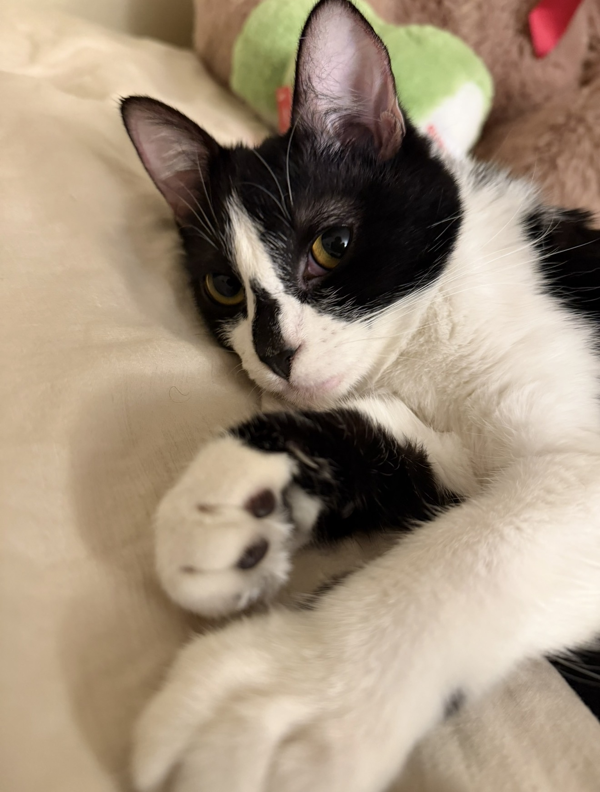
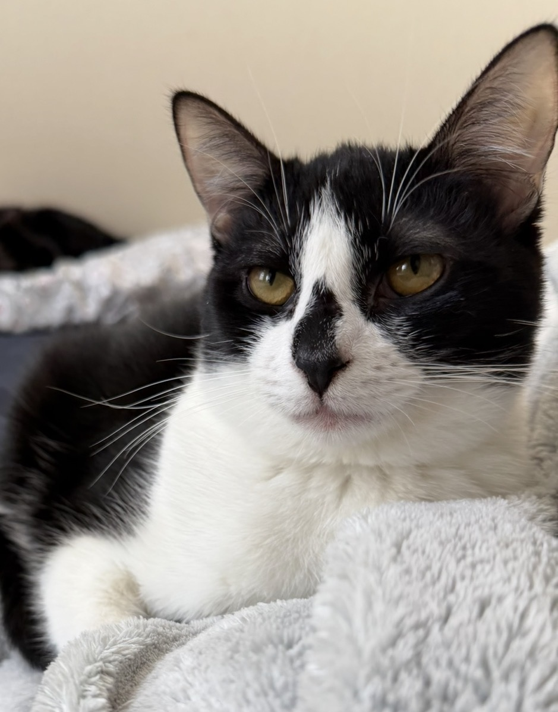

<!DOCTYPE html>
<html>
<head>
<title> My Cool Cat Zoe </title>

</head>

<body>
<h1> Cool things about my cat </h1>

 1. She likes to play with pencils 

 2. She attacks my charging cables 

 3. She looks like an Oreo 

<h2> Things my cat always does </h2>

 1. Play with her friend Snowy (other cat) 

 2. Scratches at the door (she always wants to go outside) 

 3. Eats food - she is always hungry 

https://www.petco.com/category/cat/cat-food?cm_mmc=PSH%7CGGL%7COMNI%7CCC%7CNA%7CNA%7CiuBc9fK4yULWTBpAcLDW2Q%7CENT_PSH_GGL_OMNI_CC_NA_PETCO_NA_NA_09232025_COV_PUR-OMNI_TXT-BR_NA_CAT%7C0%7C0%7C0&gclsrc=aw.ds&gad_source=1&gad_campaignid=23041281303&gbraid=0AAAAAD97F15erSoDcMojZoSXRY0lCBRAM&gclid=EAIaIQobChMIoOL8r7mKlwMVFjRECB04oDlyEAAYASAAEgLja_D_BwE

</body>
</html>
